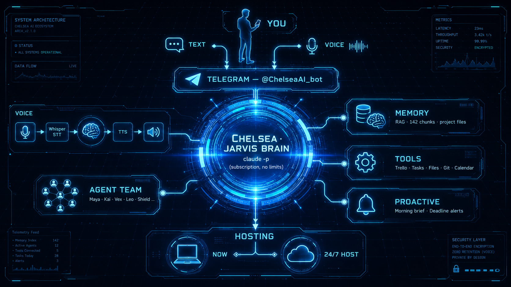

# JARVIS — Видение и дорожная карта

> Конечная цель: личный AI-оператор уровня «Джарвиса Тони Старка» — всегда на связи,
> знает о тебе всё, **действует** (не просто отвечает), проактивен, командует твоей
> командой агентов, говорит голосом. Один интерфейс ко всей твоей «империи» проектов.
>
> Зафиксировано: 2026-06-20. Владелец: Ерсултан.
>
> **Схема архитектуры (утверждена 2026-06-20):** 
> — `projects/jarvis/architecture.png`

---

## 1. Что такое «Джарвис» (свойства конечного продукта)

| # | Свойство | Что это значит для тебя |
|---|----------|-------------------------|
| 1 | **Всегда на связи** | Telegram (текст+голос) сейчас → веб/звонок позже. 24/7, без включённого ноута |
| 2 | **Знает всё** | Полная память: проекты (Haul, Bilim, Med Triage, Elza, KazBench, Gottfried…), люди, дедлайны, решения |
| 3 | **Действует** | Заводит задачи/события, драфтит письма, двигает Trello, правит файлы, запускает агентов — а не лекции читает |
| 4 | **Проактивен** | Сам пишет тебе: утренний бриф, «дедлайн горит», «CI красный перед демо», «это проседает» |
| 5 | **Командует командой** | Делегирует 12 агентам / рою ruflo большие задачи (ресёрч, код, ревью), собирает результат |
| 6 | **Мультимодален** | Голос in/out, понимает фото/документы/скрины |
| 7 | **Безопасен** | Делает правильное, спрашивает перед необратимым, права залочены |

**Мозг = `claude -p`** (полная Chelsea на твоей подписке, без потокенных лимитов).
**Лицо = Telegram-бот** (@ChelseaAI_bot) — релей: твой текст → Chelsea → ответ/действие.

---

## 2. Целевая архитектура

```
ТЫ (телефон / десктоп)
  ↕  Telegram (текст + голос)        [позже: веб-дашборд, голосовой звонок]
ЛИЦО — bot relay (jarvis_bot.py, локально/хост)
  ↕
МОЗГ — claude -p = полная Chelsea (подписка, права залочены)
  ├─ ПАМЯТЬ:  MEMORY.md + rag-cms (142 чанка, Voyage) + project-файлы + mem0
  ├─ ИНСТРУМЕНТЫ:  Trello · задачи/файлы · git/код · (позже) Calendar/Gmail
  ├─ КОМАНДА:  12 агентов (Maya/Leo/Kai/Vex/Shield…) + рой ruflo v3 — делегирование
  └─ ПРОАКТИВНОСТЬ:  cron/watchers → утренний бриф, алерты дедлайнов/рисков
ГОЛОС:  войс → Groq Whisper (STT) → Chelsea → edge-tts (TTS) → войс
ХОСТ:   ноут сейчас → лёгкий 24/7 хост (GCP e2-micro / Cloudflare) позже
```

---

## 3. Где мы сейчас (factual)

- ✅ **Память+RAG**: rag-cms локально, 142 чанка, ретрив доказан
- ✅ **Telegram-бот** @ChelseaAI_bot, залочен на тебя (TG 501125622), многопоточный
- ✅ **Мозг claude -p**: подключён, работает без лимитов, красивый HTML-вывод
- ✅ **Trello** как операционный хаб (доска Projects — Kanban 2026)
- ✅ **Команда**: 12 агентов + ruflo v3 рой (миграция сделана)
- ⏳ **Сейчас строим**: бот = полная Chelsea с действиями (Фаза A), права залочены

**Главное ограничение, которое уже знаем:** Google Calendar / Gmail — это claude.ai-интеграции,
требуют интерактивной авторизации и в headless `claude -p` недоступны. Обходы: календарь →
Trello-карточка с датой; либо отдельная настройка (service account / своя интеграция) — Фаза F.

---

## 4. Дорожная карта (фазы, шаги, «что хотим увидеть»)

### Фаза A — Chelsea в Telegram (текст, с действиями) ← СЕЙЧАС
**Цель:** бот перестаёт быть RAG-коробкой, становится полной Chelsea, которая ДЕЙСТВУЕТ.
**Шаги:**
1. Бот релеит сырой текст в `claude -p` (cwd = рабочее пространство, CLAUDE.md+память+Trello в зоне).
2. Права залочены через `--settings bot-settings.json`: allow (Read/Grep/Edit/Write/Trello), deny (rm, push, deploy, секреты, .env).
3. System-prompt: «отвечаешь в Telegram кратко; можешь действовать; необратимое — не делай».
4. «Добавь в календарь» → Trello-карточка с датой (пока Calendar не подключён).
**Что хотим увидеть:** спросил факт → ответ из памяти; «заведи задачу X» → карточка в Trello появилась;
«что проседает по Haul» → реальный разбор. Бот ДЕЛАЕТ, не отнекивается.

### Фаза B — Голос
**Цель:** говоришь Джарвису — он отвечает голосом.
**Шаги:** войс .ogg → getFile → Groq Whisper (STT, $0) → текст → Chelsea → ответ; (опц.) текст → edge-tts → войс.
**Что хотим увидеть:** надиктовал вопрос голосом → пришёл голосовой ответ.

### Фаза C — Проактивность
**Цель:** Джарвис пишет первым.
**Шаги:** cron на хосте → утренний бриф (дедлайны+Trello+риски), алерты («Med Triage демо завтра, CI красный»),
watcher на дедлайны Trello/проектов.
**Что хотим увидеть:** утром сам прислал бриф; за день — алерт по горящему.

### Фаза D — Оркестрация команды
**Цель:** делегируешь реальную работу, получаешь результат.
**Шаги:** «Джарвис, почини retrieval-баг в Elza» → Chelsea поднимает агента/воркер (git worktree, claude -p agent),
правит, гоняет тесты, открывает PR, отчитывается. (Сюда складывается трек «autopilot».)
**Что хотим увидеть:** дал задачу из Telegram → пришёл PR + отчёт (тесты, риски). Merge — за тобой.

### Фаза E — 24/7 + мультимодальность + наблюдение
**Цель:** всегда на связи; понимает фото/доки; видно, как работают агенты.
**Шаги:** хостинг бот-релея (GCP e2-micro/Cloudflare); фото/PDF в Telegram → Chelsea видит;
live-мониторинг агентов (`claude agents` / `remote-control` / свой web-дашборд через hooks).
**Что хотим увидеть:** бот жив без ноута; скинул фото договора — разобрал; смотришь агентов из браузера.

### Фаза E+ — Премиальное «лицо» (Telegram Mini App с аватаром)
**Цель:** не plain-чат, а дорогой живой интерфейс уровня Джарвиса — но внутри Telegram (одно окно).
**Стек (зафиксировано 2026-06-20):**
- **Telegram Mini App** (React) — богатый UI поверх того же мозга Chelsea (claude -p), не отдельный продукт.
- **Rive** (предпочтительно) или Lottie — реактивный аватар: состояния listening / thinking / speaking
  через state-machine. Rive интерактивнее и легче рантайм → premium-вид, не «дешёвый talking avatar».
- **Голос:** ElevenLabs (реалистичный TTS, платный) для премиум; Web Speech API как $0-фолбэк.
- Mini App = идеальное место, где сходятся **голос + аватар + действия** красиво (лучше, чем войсы в чате).
**Что хотим увидеть:** открыл Mini App в Telegram → живой аватар Chelsea слушает/думает/говорит,
премиальный UI, голосовой диалог.
**Важно по порядку:** «лицо» строим ПОСЛЕ мозга (A→D). Красивый аватар на пустом ассистенте = шелл без
ценности. Сначала Chelsea умеет действовать/проактивна/голос — потом премиум-лицо это усиливает.

### Фаза F — Внешний мир (north star)
**Цель:** реальные внешние действия.
**Шаги:** решить headless-доступ к Google Calendar/Gmail (service account / своя интеграция);
голосовой звонок как интерфейс; интеграции под конкретные проекты.
**Что хотим увидеть:** «поставь встречу» → она в Google Calendar; «ответь Виталию» → драфт письма готов.

---

## 5. Принципы (чтобы не сломать)

- **Безопасность первой:** бот залочен на тебя; права claude -p ограничены deny-списком; необратимое — с подтверждением.
- **$0 пока можно:** мозг на подписке, STT на Groq, память локально. Платим только за хост 24/7, когда дойдём.
- **Одно лицо:** всё через одного бота/Chelsea, не плодим интерфейсы.
- **Память — контракт:** решения и факты пишутся в память, Джарвис всегда грузит контекст перед действием.
- **Инкрементально:** каждая фаза — рабочий результат, который видно и можно потрогать.

---

## 6. Ближайший шаг
Доделать **Фазу A** (полная Chelsea в Telegram, права залочены) — уже одобрено и наполовину готово.
Затем по порядку B → C → D → E → F, сверяясь после каждой.

---

## 7. Автономная работа (как Джарвис действует сам)

Автономность = Джарвис не просто отвечает, а **берёт задачу, делает, проверяет, отчитывается** — в
безопасных рамках. Реализуется как очередь задач + изолированный воркер.

### Уровни автономии (по риску)
| Режим | Что делает Джарвис | Approval |
|-------|--------------------|----------|
| **L1 — Ответ/анализ** | читает память/код, даёт разбор, план | не нужен |
| **L2 — Внутренние действия** | Trello-карточки, задачи, заметки, правка файлов в ветке, запуск тестов | не нужен (autonomous) |
| **L3 — Подготовка к внешнему** | драфт письма, ветка+коммит+PR, черновик поста | показывает → ты одобряешь |
| **L4 — Внешнее/необратимое** | отправка письма, деплой в прод, merge в main, push, трата денег | **только с твоим «да»** |

Принцип: **автономность заканчивается на Pull Request / черновике.** Merge, deploy, send — за тобой.

### Автопилот-петля (для задач по коду — Фаза D)
```
Задача из Telegram / Trello
      ↓ кладётся в очередь (не теряется при рестарте)
Воркер берёт задачу
      ↓ git worktree add → изолированная ветка agent/<task>
claude -p (агент, права залочены) → правит, гоняет тесты/линт
      ↓
коммит → пуш ветки → PR
      ↓
Telegram-отчёт: ✅ ветка, тесты N passed, файлы, риски, ссылка на PR
      ↓
ТЫ: review → merge / правки / отклонить
```
Защита: каждая задача — в своём worktree (агенты не мешают друг другу), deny-список
(rm/deploy/push-в-main/секреты), макс N параллельных, лог каждого шага.

### Проактивная автономность (Джарвис пишет первым — Фаза C)
- **Утренний бриф** (cron): календарь + дедлайны Trello + топ-3 на день + риски.
- **Watcher дедлайнов:** «Med Triage демо завтра», «KazBench анонс ждёт фиксов».
- **Алерты состояния:** «CI красный перед демо», «7 коммитов не запушены», «инцидент на проде».
- **Тихие часы:** не дёргает ночью, копит и отдаёт утром.

---

## 8. Текстовый и голосовой режим

### Текст (Фаза A — сейчас)
```
Твоё сообщение в Telegram
   → bot relay → claude -p (Chelsea, память+инструменты)
   → ответ/действие → красивый HTML обратно в Telegram
```
Естественный язык, без команд: «что по Haul?», «заведи созвон в вс 16:00», «какие риски на этой неделе».

### Голос (Фаза B)
```
Войс .ogg (≤20MB) → Telegram getFile
   → Groq Whisper (STT, $0, 2000/день) → текст
   → Chelsea (как в тексте)
   → ответ текстом ИЛИ edge-tts → голосовой .ogg обратно
```
Режимы: «голос→текст» (быстро) и «голос→голос» (полный Джарвис-фил). Переключатель в боте.

### Голосовой звонок (Фаза F, north star)
Реалтайм-разговор (телефон/веб) — стрим STT↔TTS поверх Chelsea. Самый «старковский» опыт.

---

## 9. Полный доступ к проектам

Джарвис видит и действует во **всей твоей империи**, с правильной маршрутизацией по проекту
(из CLAUDE.md → Project Folder Routing):

| Проект | Рабочая директория | Что Джарвис умеет |
|--------|--------------------|--------------------|
| Haul Fuelcard | `projects/haul-fuelcard/` | статус, аудит, лендинг, push в haul-org |
| Bilim.ai | `projects/bilim-ai/` | финансы, клиенты, поступление |
| Med Triage | `projects/med_triage/` | прод-статус, демо, дедлайн 31.08 |
| Elza | `projects/elza/` | инциденты, PR, work_log, биллинг по часам |
| KazBench | `projects/...kazbench` | лидерборд, paper, анонс |
| Gottfried/SBS | `projects/sbs-logistics-digital/gottfried/` | TMS-автоматизация |
| Career/Job | `projects/career-ops/` | вакансии, резюме |
| Jarvis (сам) | `projects/jarvis/` | этот проект |

При упоминании проекта Джарвис: грузит контекст этого проекта (память + файлы + git),
работает только в его директории, ведёт его в Trello, соблюдает его правила (напр. Elza → work_log;
Haul → push в haul-org; всегда коммит+пуш после изменений).

**Память о проектах:** MEMORY.md (индекс) + per-project заметки + rag-cms семантический поиск +
mem0 долгосрочная. Джарвис всегда «знает», где что лежит и что решено.

---

## 10. День из жизни (как это ощущается)

> **08:30** — Джарвис сам пишет: *«Доброе утро. Сегодня: созвон с Нуржаном 16:00 (Med Triage).
> Горит: CI Med Triage красный перед демо. Топ-3: 1) починить CI, 2) мерж feat/status-indicator Elza,
> 3) ответить Виталию (Gottfried). 7 коммитов Haul всё ещё не запушены.»*
>
> **09:00** — Ты голосом: *«Что именно с CI Med Triage?»* → Джарвис разобрал: billing failure, не код.
>
> **09:05** — *«Джарвис, заведи задачу починить billing и напомни в 14:00»* → Trello-карточка + напоминание.
>
> **11:00** — *«Почини retrieval-баг в Elza»* → Джарвис поднял агента, через 20 мин: *«✅ PR #28: фикс
> порога, 14 тестов passed, прод не трогал. Глянь.»* Ты мержишь.
>
> **15:45** — Алерт: *«Созвон с Нуржаном через 15 мин. Тезисы и демо-логины — в карточке #55.»*
>
> **19:00** — *«Итоги дня?»* → Джарвис: что сделано, что осталось, что на завтра.

Это и есть Джарвис: знает, подсказывает, делает, прикрывает спину.

---

## 11. Команда агентов под Джарвисом

Chelsea (Джарвис) — оркестратор. За ней 12 персон + рой ruflo v3:
- **Maya** (код), **Kai** (тесты/CI), **Shield** (безопасность), **Vex** (критика),
  **Leo** (продукт), **Zara** (UX), **Alex** (продажи), **Nova** (маркетинг),
  **Rex** (финансы/право), **Макс** (стратегия), **Sora** (память).
- Большая задача → Chelsea декомпозирует и диспатчит (параллельно/последовательно),
  собирает результат, отчитывается тебе одним сообщением.
- Рой ruflo для масштабных прогонов (аудит, ресёрч, миграции).

Ты говоришь Джарвису цель — он сам решает, кого из команды задействовать.

---

## 12. ✅ ЧТО УЖЕ ГОТОВО (имя ассистента = Sana)

Ядро Джарвиса собрано на $0, 2 лица + 1 мозг:
- **Лица:** Telegram @ChelseaAI_bot (телефон) + локальный веб-центр HUD-сфера (десктоп, ярлык Sana).
- **Мозг:** claude -p (подписка, без потокенных лимитов), права залочены.
- **Фаза A** — действует: память + Trello + файлы + проекты.
- **Фаза B** — голос вход (Groq Whisper) + выход (edge-tts, $0). ElevenLabs НЕ используем.
- **Фаза C** — проактивность: утренний бриф 08:30 (дедлайны+топ-3+риски).
- **Фаза D** — автопилот: /task → ветка + правки + тесты + коммит + отчёт (без push/merge).
- **Фаза E** — мультимодальность (видит фото/скрины) + 24/7 автостарт на ноуте (watchdog, бессмертие).
- **Фаза F** — Google Calendar (ставит/читает события) + Gmail (читает + черновики).
- **Фаза E+** — веб-лицо: HUD-сфера, голосовой диалог, реакция на амплитуду.

---

## 13. 🎯 ИДЕАЛЬНЫЙ ДЖАРВИС — что осталось (Фаза G+)

Ядро работает. «Идеальный» = надёжный, быстрый, по-настоящему проактивный, всегда
доступный и самообучающийся. Оставшиеся улучшения, по приоритету:

### G1 — Память диалога (контекст разговора) 🔴 высокий
**Проблема:** сейчас каждое сообщение stateless — Sana не помнит, о чём говорили 2 минуты
назад. Спросил «а когда?» — не поймёт «когда что».
**Решение:** хранить историю последних N реплик на чат, передавать в claude -p как контекст.
**Видим:** связный диалог, можно уточнять и продолжать мысль.

### G2 — Скорость ответа 🔴 высокий
**Проблема:** claude -p стартует с нуля каждый раз (~40-80с). Для «оператора в кармане» медленно.
**Решение:** persistent-сессия (claude --resume/--continue) или лёгкий быстрый путь для
простых вопросов (память без полного агента), полный агент — только для действий.
**Видим:** простой вопрос — 5-10с, действие — как сейчас.

### G3 — Память не устаревает (авто-синхронизация) 🟠 средний
**Проблема:** видели вживую — Sana считала бот незалоченным (старый TODO), бриф ссылался на
закрытые задачи. Память расходится с реальностью.
**Решение:** Sana по итогу действий обновляет MEMORY/заметки; периодический «sync-pass» —
сверка памяти с Trello/git/реальностью; пометки «закрыто».
**Видим:** Sana всегда говорит актуальное, сама правит устаревшее.

### G4 — Проактивность 2.0: watchers в течение дня 🟠 средний
**Сейчас:** только утренний бриф.
**Решение:** event-watchers → алерты сами: CI покраснел, важное письмо (Gmail), дедлайн Trello
завтра, событие календаря через час. Тихие часы. Дайджест вечером.
**Видим:** Sana пишет первой не раз в день, а когда реально что-то случилось.

### G5 — Надёжность и аудит ✅ ГОТОВ (2026-06-20)
**Сделано:** (1) retry на сбоях — `_run_claude()` повторяет `claude -p` при rc!=0 (холодный старт);
(2) понятные ошибки — `friendly_error()` (таймаут/сбой/нет связи вместо стектрейса);
(3) аудит-лог всех действий — `audit/actions.jsonl` + команда `/audit`;
(4) `/undo` — отменяет последнее обратимое действие (Trello/notes/событие) по аудит-логу;
(5) лимит на необратимое — deny-list + undo трогает только L2, на внешнее отказывается.
**Видим:** доверие — видно что Sana делала (/audit), можно откатить (/undo).

### G6 — Доступ к веб-центру с телефона 🟡 ниже
**Проблема:** веб-лицо на localhost — только на ноуте.
**Решение:** Cloudflare Tunnel ($0) → защищённый URL → HUD-сфера с телефона/где угодно.
**Видим:** красивое лицо Sana доступно с любого устройства.

### G7 — Хостинг 24/7 без ноута (GCP e2-micro) 🟡 ниже
**Решение:** перенос ядра на GCP Always Free (кит готов в DEPLOY.md). Память синкается.
**Видим:** Sana жива даже когда ноут выключен.

### G8 — Rive-аватар вместо сферы 🟢 опционально
**Решение:** взять/нарисовать .riv (state-machine listening/thinking/speaking), подключить в веб-лицо.
**Видим:** живой персонаж-аватар вместо абстрактной сферы.

### G9 — Оркестрация команды из чата 🟢 опционально
**Решение:** «Sana, собери команду на аудит Elza» → поднимает рой ruflo / нескольких агентов,
собирает результат. Сейчас /task = один агент.
**Видим:** делегируешь крупное — Sana дирижирует командой.

---

## 14. Каким видим ФИНАЛЬНЫЙ продукт (1 абзац)

Sana — личный AI-оператор Ерсултана, доступный мгновенно с телефона (голос/текст в Telegram)
и с десктопа (живой веб-аватар). Она помнит весь контекст и все проекты, отвечает за секунды,
сама пишет когда что-то важное случилось, ставит встречи и разбирает почту, ведёт задачи,
делает реальную работу по коду руками команды агентов и открывает PR, никогда не делает
необратимого без спроса, всегда говорит актуальное и живёт 24/7 — всё на $0. Не чат-бот,
а оператор, который реально снимает с тебя операционку.

---

## 15. Порядок добивания
G1 (контекст) → G2 (скорость) — это самые ощутимые для ежедневного юза.
Затем G3 (актуальная память) + G4 (watchers) — углубляют проактивность.
G5 (надёжность) параллельно. G6/G7 (доступ/хостинг) — инфраструктура. G8/G9 — вишенки.
